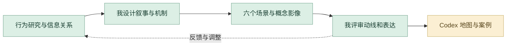

# 相亲营销嘉年华

将相亲规则转为六个连通的三维叙事空间。

**[完整设计案例](https://xiongzhiyuan-portfolio.pages.dev/zh/work/dating-carnival/) · [求职作品总入口](https://github.com/Zhiyuan-Xiong/xiongzhiyuan-portfolio)**

## 项目目标

《相亲嘉年华》围绕相亲过程中“信息如何被展示、筛选与判断”展开。通过对现实相亲行为与沟通方式的观察，将身份包装、条件匹配、信任验证与外部评价转化为可操作的游戏机制。项目以六个连续场景构建完整体验流程，通过用户选择、系统反馈与多结果路径，使隐性的婚恋营销、信息差与关系判断过程转化为可感知、可验证、可反思的交互体验。

## 我的贡献

交互叙事、场景与视觉设计

完成阶段：概念设计、场景可视化与概念影像

现有产出：研究梳理、六个场景、选择与反馈机制、概念视觉

## 设计制作与 AI 协作工作流

把现实中的信息展示、筛选、信任和外部评价转为六个连续场景。我负责交互叙事、场景与视觉；AI 协作帮助当前案例的机制整理与网页呈现。

| 阶段 | 制作、判断与 AI 协作 |
| --- | --- |
| **1. 从行为观察发散情境** | 围绕身份包装、条件匹配、信任验证与家庭评价展开研究，提炼参与者在关系判断中的选择与反馈。场景设立基于这些行为关系。 |
| **2. 整理信息与叙事结构** | 对照早期研究、故事分镜和各场景机制，借助 AI 组织章节与规则表达。由我判断每一空间承担的叙事任务，保证六个场景的体验递进。 |
| **3. 我设计机制和视觉语言** | 把进入市场、人物档案、筛选、验证、外部评价与关系结果组织成可感知的路径。场景、道具、角色行为和视觉符号共同服务于机制。 |
| **4. 场景制作与概念影像** | 完成概念场景、选择反馈与影像呈现，比较模型和渲染中的动线、主次与叙事可读性。数字场景是我设计的核心成果。 |
| **5. Codex 组织地图与机制展示** | 当前作品集由 Codex 辅助实现地图导航、场景章节和机制图表。我核对规则、选择路径与视觉比例，让网页能够清楚解释原作品。 |
| **6. 反馈回到逻辑和表达** | 将不清晰的规则或场景关系转为明确修改任务，回到 Chat 梳理说明或 Codex 调整数字呈现。保留研究图、六个场景、故事序列与案例代码。 |

### 审美与专业评审

| 评审维度 | 我的专业判断 |
| --- | --- |
| **逻辑清晰** | 规则、选择和反馈都能对应具体场景。 |
| **视觉叙事** | 构图、道具与空间关系支撑同一世界观。 |
| **信息准确** | 网页地图和机制说明对照原设计核验。 |

**过程证据：** [早期研究](media/dating/research-early-1.webp) · [故事与场景资料](media/dating/) · [机制图表组件](site-source/components/FestivalMechanismDiagram.astro) · [交互与导航](site-source/scripts/dating-festival.ts)

[阅读完整的项目工作流](工作流.md) · [我的 AI 设计方法](https://github.com/Zhiyuan-Xiong/xiongzhiyuan-portfolio/blob/main/docs/AI设计工作流.md)

## 仓库内容

- [media/](media/)：项目公开影像、图像与交互数据。
- [images/](images/)：作品集封面与不同尺寸展示图。
- [site-source/](site-source/)：对应案例文案、页面组件与相关交互实现。
- [case-data.json](case-data.json)：项目目标、职责、章节与产出信息。

## 查看与使用

GitHub 中可直接浏览图像、GIF、文案与实现文件。完整交互与影像观看入口为顶部的在线案例。网页组件的完整构建环境位于 [作品集总仓库](https://github.com/Zhiyuan-Xiong/xiongzhiyuan-portfolio)。

## 署名与使用

作品素材用于个人设计展示。协作项目以案例中的职责说明为准；字体、引擎和第三方资料遵循各自授权。未经许可，不将作品素材用于转载或商业用途。
