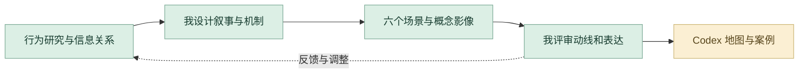

# 相亲营销嘉年华｜详细设计与 AI 协作工作流

把现实中的信息展示、筛选、信任和外部评价转为六个连续场景。我负责交互叙事、场景与视觉；AI 协作帮助当前案例的机制整理与网页呈现。

## 1. 从行为观察发散情境

围绕身份包装、条件匹配、信任验证与家庭评价展开研究，提炼参与者在关系判断中的选择与反馈。场景设立基于这些行为关系。

## 2. 整理信息与叙事结构

对照早期研究、故事分镜和各场景机制，借助 AI 组织章节与规则表达。由我判断每一空间承担的叙事任务，保证六个场景的体验递进。

## 3. 我设计机制和视觉语言

把进入市场、人物档案、筛选、验证、外部评价与关系结果组织成可感知的路径。场景、道具、角色行为和视觉符号共同服务于机制。

## 4. 场景制作与概念影像

完成概念场景、选择反馈与影像呈现，比较模型和渲染中的动线、主次与叙事可读性。数字场景是我设计的核心成果。

## 5. Codex 组织地图与机制展示

当前作品集由 Codex 辅助实现地图导航、场景章节和机制图表。我核对规则、选择路径与视觉比例，让网页能够清楚解释原作品。

## 6. 反馈回到逻辑和表达

将不清晰的规则或场景关系转为明确修改任务，回到 Chat 梳理说明或 Codex 调整数字呈现。保留研究图、六个场景、故事序列与案例代码。

## 审美与专业评审

| 评审维度 | 我的专业判断 |
| --- | --- |
| **逻辑清晰** | 规则、选择和反馈都能对应具体场景。 |
| **视觉叙事** | 构图、道具与空间关系支撑同一世界观。 |
| **信息准确** | 网页地图和机制说明对照原设计核验。 |

## 过程证据

[早期研究](media/dating/research-early-1.webp) · [故事与场景资料](media/dating/) · [机制图表组件](site-source/components/FestivalMechanismDiagram.astro) · [交互与导航](site-source/scripts/dating-festival.ts)

[项目原说明](README.md) · [完整 AI 方法](https://github.com/Zhiyuan-Xiong/xiongzhiyuan-portfolio/blob/main/docs/AI设计工作流.md)
